完成了基本要求：  
• NoteList界面中笔记条目增加时间戳显示  
• 添加笔记查询功能（根据标题或内容查询）  
拓展功能：  
• 笔记排序  
• UI美化（改成了白色主题和添加了笔记的图标）  
• 笔记导出  
• 笔记内字体的大小和颜色的更改以及背景切换  
**项目结构图如下：**      
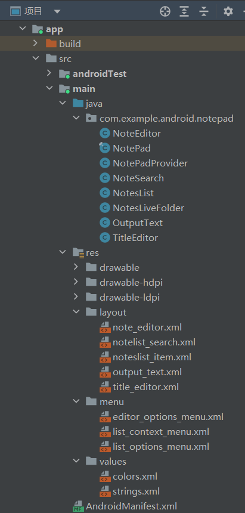  

### 代码说明在最后    

# **1.主界面的时间戳**      

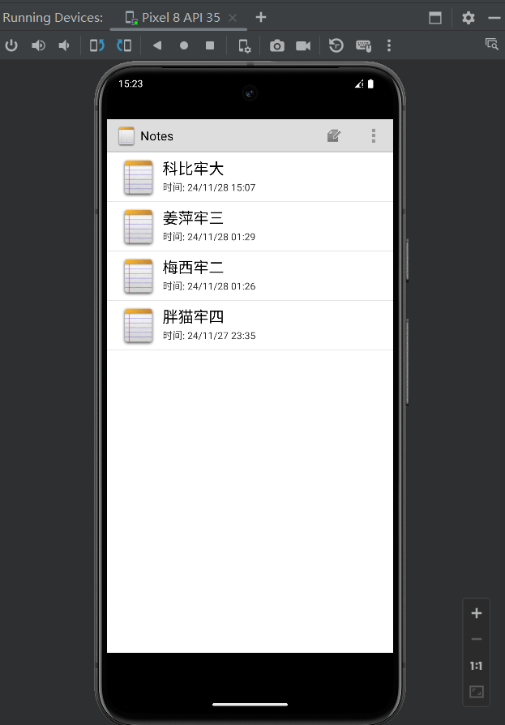    

# **2.搜索功能**    

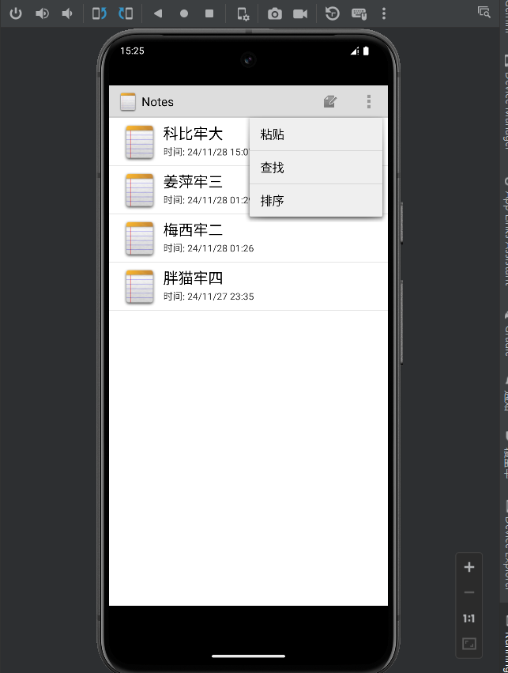  
点击查找后  
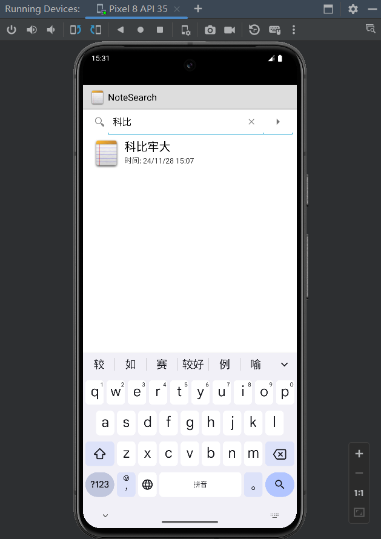  

# **3.笔记排序**    

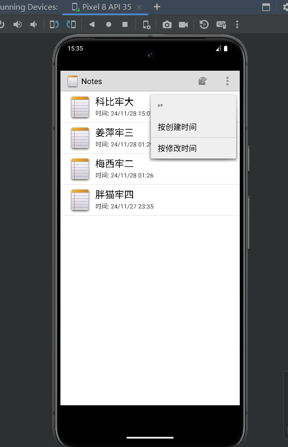  
点击按照创建时间排序  
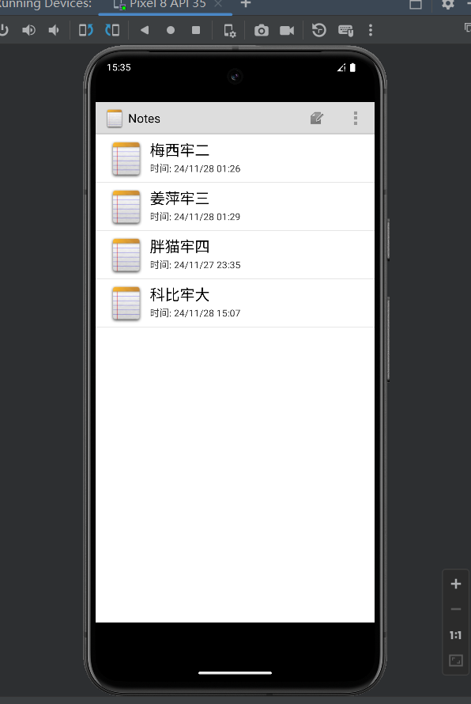  
点击按照修改时间排序  
  

# **4.笔记内字体以及背景更改**    

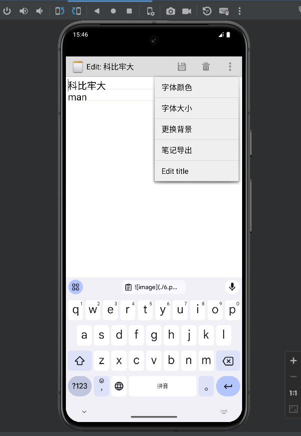  
字体改为大号，颜色改为蓝色  
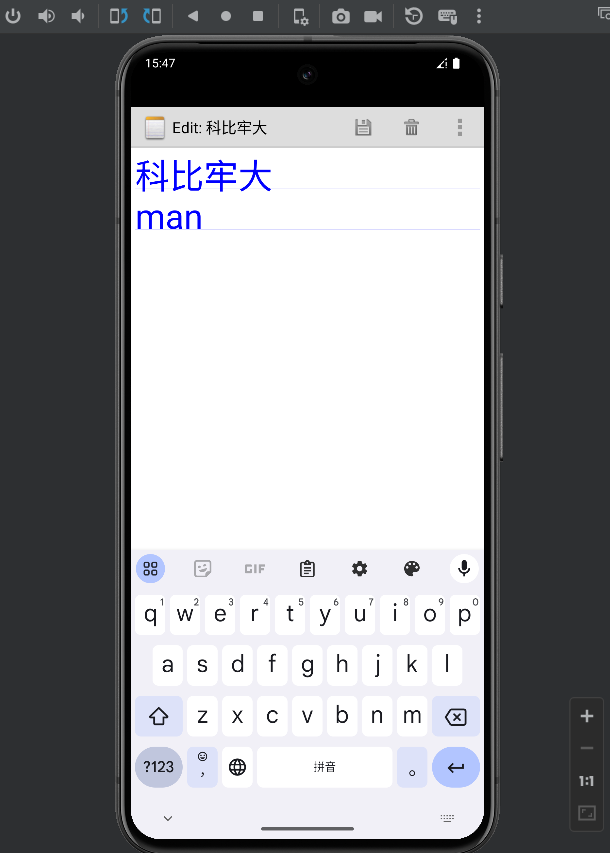  
改背景  
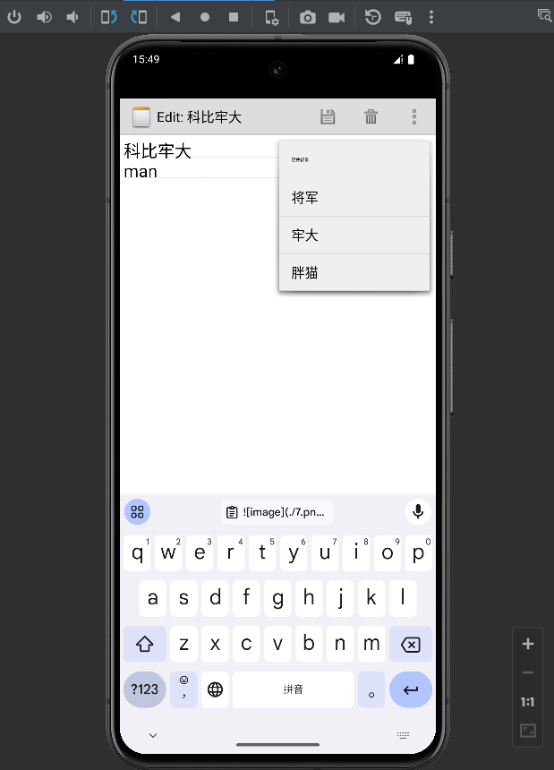  
选择胖猫  
  

# **5.笔记导出**    

  
点击确定后  
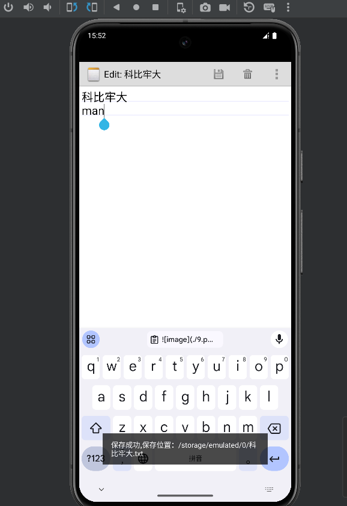  
在文件管理器查看  
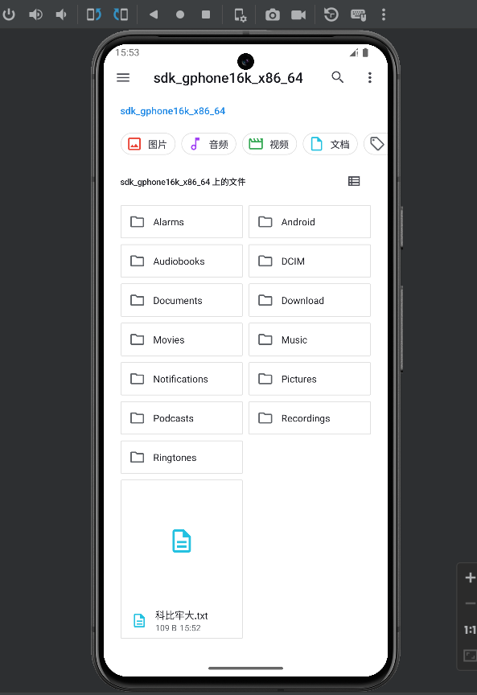  
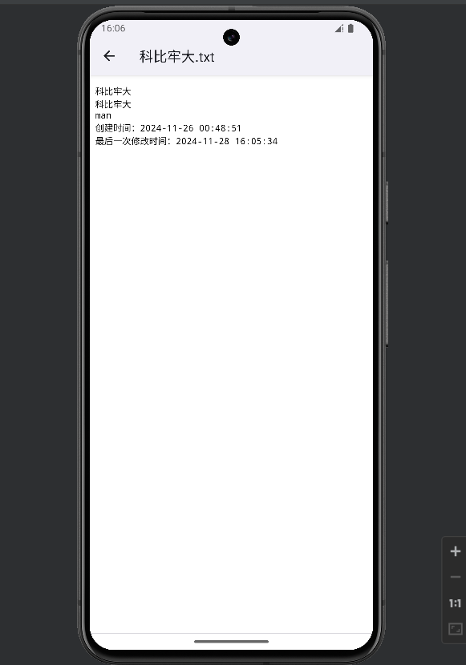  
# **1.主界面的时间戳**  
1.布局文件noteslist_item.xml中添加时间戳    
```
<TextView
android:id="@android:id/text2"
android:layout_width="match_parent"
android:layout_height="25dp"
android:singleLine="true"
android:text="时间:" />
```  
2.在NoteList.java中的PROJECTION中添加COLUMN_NAME_MODIFICATION_DATE字段  
`
private static final String[] PROJECTION = new String[] {
NotePad.Notes._ID, // 0
NotePad.Notes.COLUMN_NAME_TITLE, // 1
NotePad.Notes.COLUMN_NAME_MODIFICATION_DATE, //加入了修改时间的显示
};
`
3.修改适配器内容，增加dataColumns中装配到ListView的内容,同时增加一个ID标识来存放该时间参数  
`
String[] dataColumns = { NotePad.Notes.COLUMN_NAME_TITLE,
NotePad.Notes.COLUMN_NAME_MODIFICATION_DATE } ;
int[] viewIDs = { android.R.id.text1 ,android.R.id.text2};
`
4.在NoteEditor.java的updateNote方法中获取当前系统的时间，并对时间进行格式化,新建笔记时添加时间戳数据  
`
// Sets up a map to contain values to be updated in the provider.
ContentValues values = new ContentValues();
// 获取当前手机时间转化时间格式  
Long now = Long.valueOf(System.currentTimeMillis());
SimpleDateFormat sf = new SimpleDateFormat("yy/MM/dd HH:mm");
Date d = new Date(now);
String format = sf.format(d);
values.put(NotePad.Notes.COLUMN_NAME_MODIFICATION_DATE, "时间: "+format);// System.currentTimeMillis());
`
# **2.搜索功能**    
1.在list_options_menu.xml布局文件中添加搜索功能  
`
<item
android:id="@+id/menu_search"
android:icon="@android:drawable/ic_menu_search"
android:title="查找"/>
`
2.新建一个查找笔记的布局文件notelist_search.xml  
```
<?xml version="1.0" encoding="utf-8"?>
<LinearLayout xmlns:android="http://schemas.android.com/apk/res/android"
    android:layout_width="match_parent"
    android:layout_height="match_parent"
    android:orientation="vertical">
    <SearchView
        android:id="@+id/search_view"
        android:layout_width="match_parent"
        android:layout_height="wrap_content"
        android:iconifiedByDefault="false"
        />
    <ListView
        android:id="@+id/list_view"
        android:layout_width="match_parent"
        android:layout_height="wrap_content"
        />
</LinearLayout>

```
3.在NoteList.java中的onOptionsItemSelected方法中添加查询activity的跳转    
`
case R.id.menu_search:
//查找笔记功能界面跳转  
Intent intent = new Intent(this, NoteSearch.class);
this.startActivity(intent);
return true;
`
4.NoteSearch类  
具体见项目内代码
# **3.笔记排序**
1.在list_options_menu.xml布局文件中添加菜单  
```
<item
        android:id="@+id/menu_sort"
        android:title="排序"
         >
        <menu>
            <item
                android:id="@+id/menu_sort1"
                android:title="按创建时间"/>
            <item
                android:id="@+id/menu_sort2"
                android:title="按修改时间"/>
        </menu>
    </item>
```
2.修改适配器内容，增加dataColumns中装配到ListView的内容,同时增加一个ID标识来存放该时间参数  
`
private SimpleCursorAdapter adapter;
private Cursor cursor;
private String[] dataColumns = { NotePad.Notes.COLUMN_NAME_TITLE ,  NotePad.Notes.COLUMN_NAME_MODIFICATION_DATE } ;
private int[] viewIDs = { android.R.id.text1 , android.R.id.text2};
`
3.在NoteList.java中的onOptionsItemSelected方法中添加排序activity的跳转  
`
//创建时间排序
case R.id.menu_sort1:
cursor = managedQuery(
getIntent().getData(),
PROJECTION,
null,
null,
NotePad.Notes._ID
);
adapter = new SimpleCursorAdapter(
this,
R.layout.noteslist_item,
cursor,
dataColumns,
viewIDs
);
setListAdapter(adapter);
return true;
//修改时间排序
case R.id.menu_sort2:
cursor = managedQuery(
getIntent().getData(),
PROJECTION,
null,
null,
NotePad.Notes.DEFAULT_SORT_ORDER
);
adapter = new SimpleCursorAdapter(
this,
R.layout.noteslist_item,
cursor,
dataColumns,
viewIDs
);
setListAdapter(adapter);
return true;
`
# **4.笔记内字体以及背景更改**   
1.在editor_options_menu.xml布局文件中添加菜单  
```
    <item
        android:title="字体颜色">
        <menu>
            <group>
                <item android:id="@+id/red_font"
                    android:title="红色"/>
                <item android:id="@+id/black_font"
                    android:title="黑色"/>
                <item android:id="@+id/green_font"
                    android:title="绿色"/>
                <item android:id="@+id/blue_font"
                    android:title="蓝色"/>
                <item android:id="@+id/yellow_font"
                    android:title="黄色"/>
            </group>
        </menu>
    </item>
    <item android:title="字体大小">
        <menu>
            <group>
                <item android:id="@+id/font_10"
                    android:title="小"/>
                <item android:id="@+id/font_16"
                    android:title="中"/>
                <item android:id="@+id/font_20"
                    android:title="大"/>
            </group>
        </menu>
    </item>
    <item
        android:title="更换背景">
        <menu>
            <group>
                <item android:id="@+id/drawable_one"
                    android:title="将军"/>
                <item android:id="@+id/drawable_two"
                    android:title="牢大"/>
                <item android:id="@+id/drawable_three"
                    android:title="胖猫"/>
            </group>
        </menu>
    </item>
```
2.在NoteEditor.java中的onOptionsItemSelected方法中添加颜色和背景的activity的跳转  
`
case R.id.font_10:
mText.setTextSize(20);
break;
case R.id.font_16:
mText.setTextSize(32);
break;
case R.id.font_20:
mText.setTextSize(40);
break;
case R.id.red_font:
mText.setTextColor(Color.RED);
break;
case R.id.black_font:
mText.setTextColor(Color.BLACK);
break;
case R.id.green_font:
mText.setTextColor(Color.GREEN);
break;
case R.id.blue_font:
mText.setTextColor(Color.BLUE);
break;
case R.id.yellow_font:
mText.setTextColor(Color.YELLOW);
break;
case R.id.drawable_one:
setContentView(R.layout.note_editor);
TextView tv1 = (TextView) findViewById(R.id.note);
tv1.setBackgroundResource(R.drawable.jiangjun);
break;
case R.id.drawable_two:
setContentView(R.layout.note_editor);
TextView tv2 = (TextView) findViewById(R.id.note);
tv2.setBackgroundResource(R.drawable.laoda);
break;
case R.id.drawable_three:
setContentView(R.layout.note_editor);
TextView tv3 = (TextView) findViewById(R.id.note);
tv3.setBackgroundResource(R.drawable.pangmao);
break;
`
# **5.笔记导出**    
1.在editor_options_menu.xml布局文件中添加菜单  
`
<item android:id="@+id/menu_output"
android:title="笔记导出" />
`
2.在NoteEditor.java中的onOptionsItemSelected方法中添加笔记导出的activity的跳转  
`
case R.id.menu_output:
outputNote();
`
3.在NoteEditor.java中添加outputNote()函数  
`
//跳转导出笔记的activity，将uri信息传到新的activity
private final void outputNote() {
Intent intent = new Intent(null,mUri);
intent.setClass(NoteEditor.this,OutputText.class);
NoteEditor.this.startActivity(intent);
}
`
4.OutputText.java和output_text.xml具体见项目文件  
5.向AndroidManifest.xml中将这个Acitvity主题定义为对话框样式，并且加入权限：  
```
  <!--添加导出activity-->
        <activity android:name="OutputText"
            android:label="@string/output_name"
            android:theme="@android:style/Theme.Holo.Dialog"
            android:windowSoftInputMode="stateVisible">
        </activity>


    </application>
    <!-- 在SD卡中创建与删除文件权限 -->
    <uses-permission android:name="android.permission.MOUNT_UNMOUNT_FILESYSTEMS"
        tools:ignore="ProtectedPermissions,WrongManifestParent" />
    <!-- 向SD卡写入数据权限 -->
    <uses-permission android:name="android.permission.WRITE_EXTERNAL_STORAGE"
        tools:ignore="WrongManifestParent" />

```


