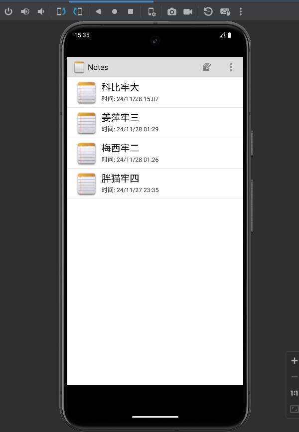
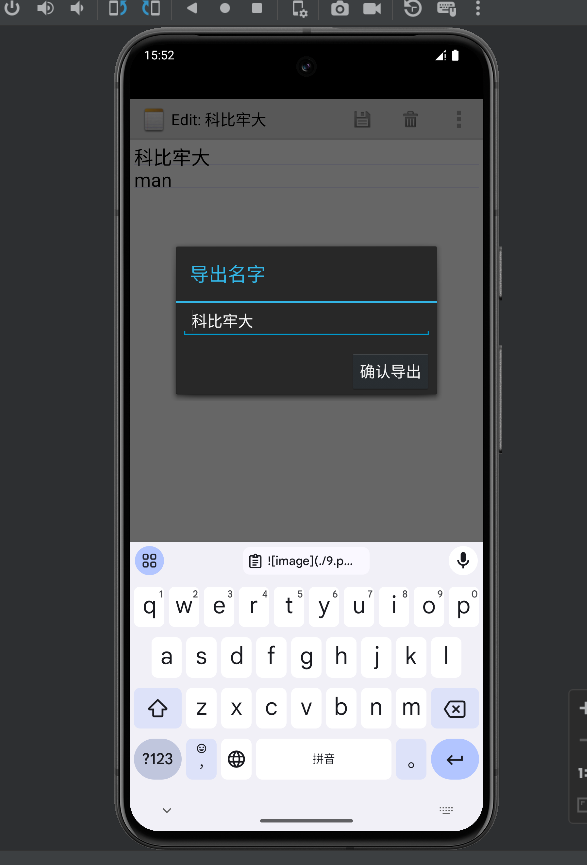

完成了基本要求：  
• NoteList界面中笔记条目增加时间戳显示  
• 添加笔记查询功能（根据标题或内容查询）  
拓展功能：  
• 笔记排序
• UI美化（改成了白色主题和添加了笔记的图标）  
• 笔记导出  
• 笔记内字体的大小和颜色的更改以及背景切换  
**项目结构图如下：**    
  
**1.主界面的时间戳**    
  
**2.搜索功能**  
  
点击查找后  
  
**3.笔记排序**  
  
点击按照创建时间排序  
  
点击按照修改时间排序  
  
4.笔记内字体以及背景更改  
  
字体改为大号，颜色改为蓝色  
  
改背景  
  
选择胖猫  
  
**5.笔记导出**  
  
点击确定后  
  
在文件管理器查看  
  
  
